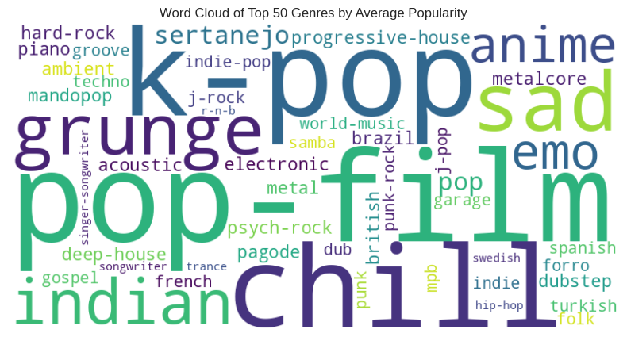
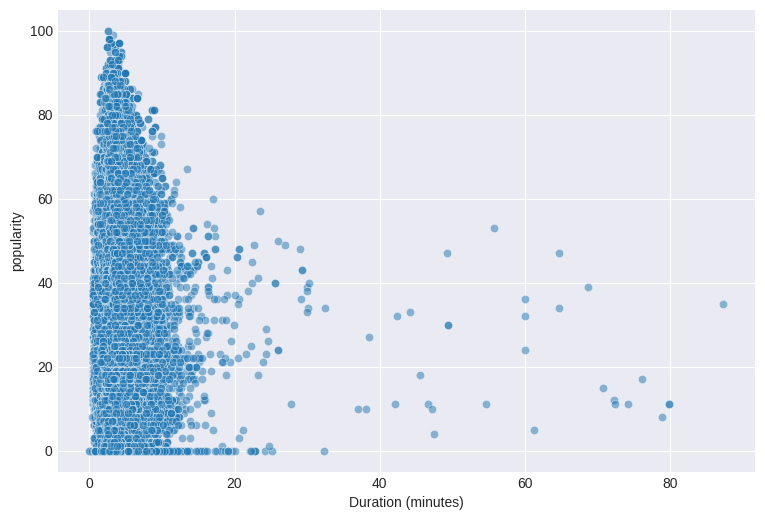
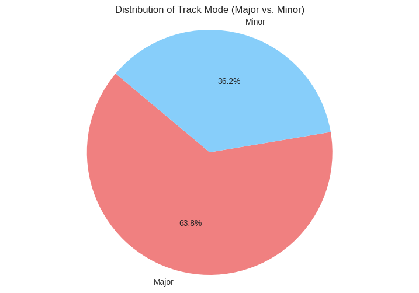
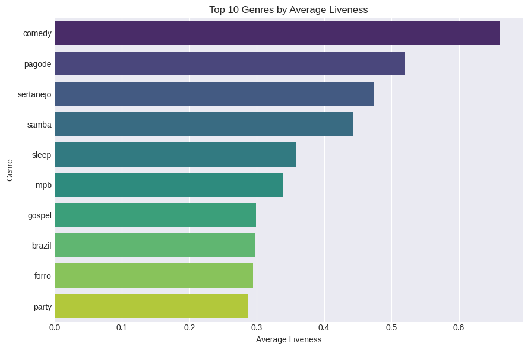
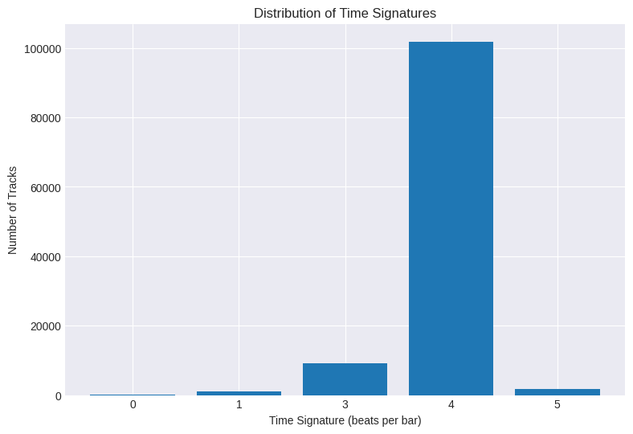
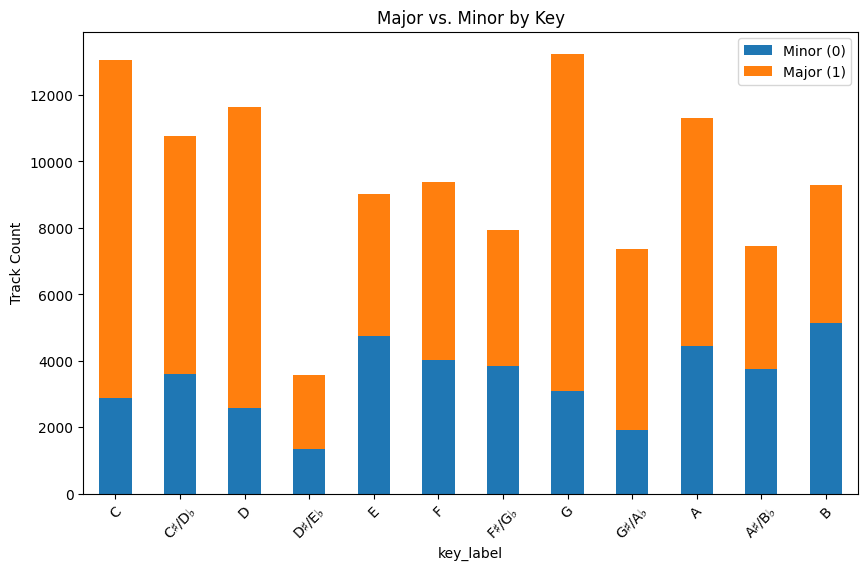

# 🎧 Spotify Tracks EDA

## 🔍 Quick Summary

This project presents a deep exploratory data analysis (EDA) of a Spotify music dataset with over 200,000 tracks. The goal was to extract meaningful insights from audio and metadata attributes to better understand listener trends, artist behaviors, and musical structures. We explored relationships between track characteristics like loudness, energy, acousticness, popularity, speechiness, key, mode, and more—driving forward business intelligence and potential product enhancements for music platforms.

---

## 🧰 Tools Used

* **Python**
* **Pandas**
* **NumPy**
* **Matplotlib**
* **Seaborn**
* **WordCloud**

---

## 📈 Insights from Features

### 1. 🎵 Most Popular Genres (Top 50)

* We used a **word cloud** to visualize the most frequent genres among the top 50 most popular tracks.
* **Observation:** Genres like *pop*, *dance pop*, *rap*, *trap*, *hip hop*, *k-pop*, *EDM*, *tropical house*, *electropop*, and *modern rock* dominate the popularity rankings.

📌 **Embed Word Cloud:**

---

### 2. ⏱️ Popularity vs Duration

* A **scatter plot** shows how popularity changes with the duration of tracks.
* **Observation:** Tracks around **180–240 seconds (3–4 minutes)** tend to be the most popular, indicating an optimal range for streaming success.

📌 **Embed Scatter Plot:**

---

### 3. 🔞 Explicit Content by Artist

* Using a **pie chart**, we explored the proportion of explicit vs. non-explicit tracks.
* **Observation:** Artists like *Drake*, *Eminem*, *Travis Scott*, *Kanye West*, *21 Savage*, *Doja Cat*, *Cardi B*, *Lil Baby*, *Post Malone*, and *Megan Thee Stallion* consistently release explicit content.

📌 **Embed Pie Chart:**

---

### 4. 🔊 Energy vs. Loudness

* We used a **scatter plot** to assess the relationship between energy and loudness.
* **Observation:** There is a **strong positive correlation**, meaning louder tracks are generally more energetic—ideal for parties or workout playlists.

📌 **Embed Scatter Plot:**

---

### 5. 🎼 Mode Distribution (Major vs Minor)

* A **pie chart** illustrates the distribution of tracks between major and minor modes.
* **Observation:** Approximately **60% of tracks** are in major mode, while the rest are in minor, supporting the dominance of upbeat music styles.

📌 **Embed Pie Chart:**

---

### 6. 🗣️ Top Genres by Speechiness

* We used a **bar plot** to rank genres based on average speechiness.
* **Observation:** Genres such as *comedy*, *spoken word*, *rap*, and *hip hop* show the highest levels of speechiness, reflecting lyrical or dialogue-heavy compositions.

📌 **Embed Bar Plot:**

---

### 7. 🌲 Acousticness Binned Distribution

* We binned acousticness into levels (low, medium, high) and created a **bar plot** to show distribution.
* **Observation:** Most tracks have low acousticness, highlighting a bias toward electronic or heavily produced music.

📌 **Embed Bar Plot:**

---

### 8. 🎤 Top Genres by Liveness

* A **bar plot** shows the top 10 genres based on average liveness.
* **Observation:** Genres like *live worship*, *jazz fusion*, and *folk* scored higher in liveness, implying more live-recorded or performance-oriented content.

📌 **Embed Bar Plot:**

---

### 9. ⏱ Time Signature Distribution

* A **bar chart** visualizes the distribution of different time signatures.
* **Observation:** Over **90%** of tracks are in **4/4 time**, the global standard in modern music.

📌 **Embed Bar Plot:**

---

### 10. 🔑 Key Distribution (Major vs Minor Keys)

* A **bar chart** shows how major and minor keys distribute across musical keys (C, D, E, etc).
* **Observation:** Keys like *C major*, *G major*, and *A minor* are most common—useful for harmonics-based playlist transitions.

📌 **Embed Bar Plot:**

---

## 💼 Business Takeaways & Models

* **Playlist Personalization:** Use energy, loudness, and mood-based clusters to generate daily “vibe”-driven playlists.
* **Explicit Filter Modes:** Offer content filters based on artist explicitness for younger or sensitive listeners.
* **Speech-to-Track Cross-Recommendations:** Integrate podcast and rap content using speechiness as an anchor.
* **Time-Length Optimization:** Recommend 3–4 min track durations to producers for algorithmic boosting.
* **Key & Mode-Based Discovery:** Tailor playlists based on preferred musical key and emotional mode.

---

## 🧪 Future Implementations

### 🔹 Data Cleaning & Processing

* Handle missing/null values
* Convert `duration_ms` to `minutes`
* Bin continuous variables (e.g., acousticness, speechiness)
* Label-encode `mode`, `key`, `time_signature`

### 🔹 Model Development

* Build regression models to predict popularity from audio features
* Use clustering (e.g., KMeans) to find track archetypes
* Dimensionality reduction (PCA, UMAP) for visualization & embedding

---

## 🔬 Future Research Directions

* Analyze playlist structures to understand transition trends
* Apply sentiment analysis on lyrics in correlation with valence
* Deep genre embedding using NLP models
* Predict virality based on pre-release features

---

## 📚 Dataset Source

* [Spotify Tracks Dataset by maharshipandya (Kaggle)](https://www.kaggle.com/datasets/maharshipandya/-spotify-tracks-dataset)

---

*Generated from in-depth analysis using Python, pandas, seaborn, and matplotlib.*
